<p align="center"></p>

# W1TN3SS <sub>(証 · witness)</sub>

Privacy-first, **opt-in** crash / error / issue reporting SDK for the Itasha app
fleet. The sealed witness testifies only when you permit it — never a beacon,
never always-on.

## Principles

- **Opt-in, default-OFF, per stream.** Crash reports and manual issues are
  separate consented streams. Nothing is sent without your explicit consent.
- **Data-minimized.** No persistent install-id, no fingerprint; reports carry an
  ephemeral per-report nonce or nothing. Backtraces are path/username/env
  sanitized (allowlist redaction). Reports are honestly **pseudonymous**, never
  marketed as "anonymous."
- **Previewable + redactable.** You see and can edit the literal report payload
  before it is ever sent.
- **Self-hosted, no SaaS.** The client speaks the Sentry minidump-envelope wire
  behind an `IngestBackend` boundary — point it at the in-house pipeline now, a
  self-hosted Sentry later, with no client change.
- **`#![forbid(unsafe_code)]`.** All native crash capture is quarantined in the
  isolated `itasha-crash-capture` sibling crate so consuming apps stay unsafe-free.

## Crates

| Crate | What |
|---|---|
| [`itasha-report-core`](crates/itasha-report-core) | Safe SDK spine: two-stream config, sanitizer, local spool, hardened transport, `IngestBackend` + Sentry-envelope wire, previewable payload, GitHub-issue / clipboard / mailto intake helpers. `send` requires a non-forgeable `ConsentToken`. |
| [`itasha-crash-capture`](crates/itasha-crash-capture) | Unsafe-isolated native minidump capture (Tier-2), out-of-process. Spooled locally, never auto-sent; gated on heightened consent. |

## Use

```toml
[dependencies]
itasha-report-core = { git = "https://github.com/46b-ETYKiAL/Itasha.Corp_S4F3-W1TN3SS", tag = "itasha-report-core-v0.1.0" }
```

Apache-2.0. The self-hosted server is private (`Itasha.Corp_S4F3-W1TN3SS-S3RV3R`).

<p align="center"></p>
